# Sitecore Serialization Explorer

A Visual Studio Code extension that helps Sitecore developers visualize, inspect, validate, and edit Sitecore Content Serialization (SCS) configuration from inside the IDE.

* [Main Features](#main-features)
* [Installation](#installation)
* [Configuration](#configuration)
* [Authentication](#authentication)
* [Features](#features)

## Main Features

**1) A live Sitecore Content Tree (via Authoring GraphQL):**

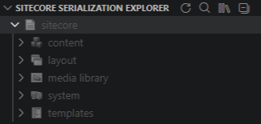

**2) Serialization status visualization (direct, indirect, untracked, not serialized):**

| Serialized (colored) | Not Serialized (grayed out) |
| --- | --- | 
| 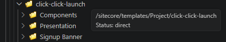 | 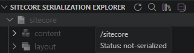 |

**3) Integrated `Explain` analysis.**
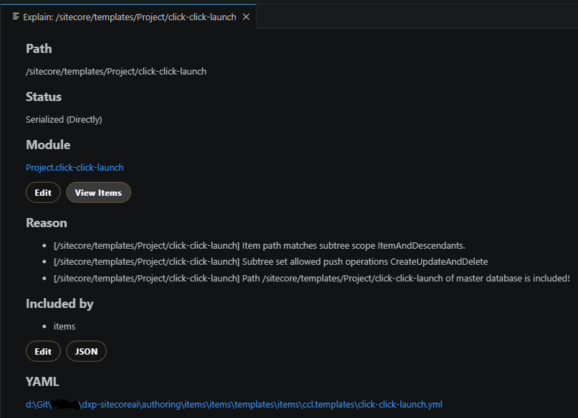

**4) Module-level exploration across configured `json` files.**
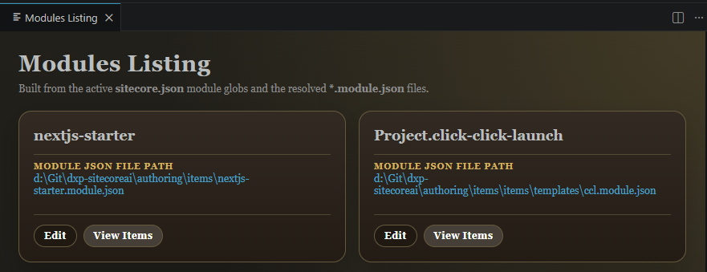

**5) In-editor module configuration editing for includes, rules, excluded fields, roles, and users.**
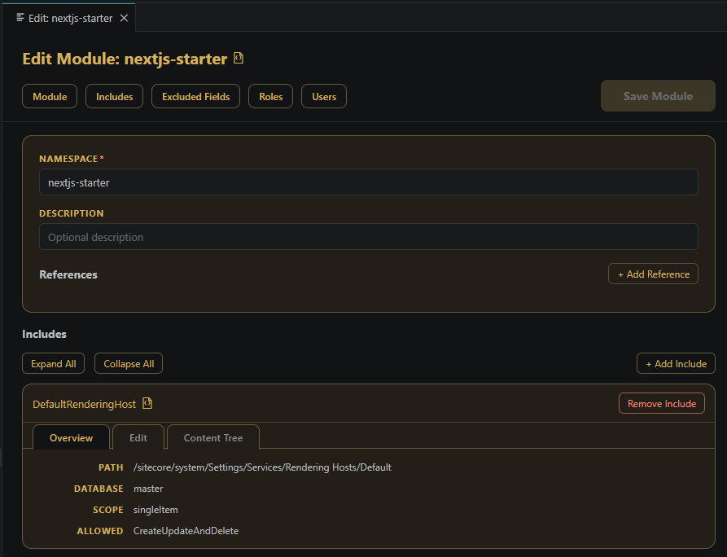

## Installation

Install the module using one of the options below:

* Search for "Sitecore Serialization Explorer" and install using Visual Studio Code Extensions

2. Search for "Sitecore Serialization Explorer" and install using [Visual Studio Marketplace](https://marketplace.visualstudio.com/)
3. Download and install from the [GitHub Repository](https://github.com/peplau/sitecore-serialization-explorer)

## Configuration

1. Open your solution folder in Visual Studio Code
2. Create a file for environment variables (Eg:/.env.local) at the root of your folder and add the variables:

| Variable Name | How to obtain it |
| --- | --- |
| SITECORE_EDGE_HOSTNAME | SitecoreAI Deploy > Projects > [Your Project] > [Environment] > Details > Scroll down to "Preview GraphQL IDE" > Launch IDE > Copy the CURL |
| SITECORE_EDGE_CONTEXT_ID | SitecoreAI Deploy > Projects > [Your Project] > [Environment] > Developer settings > Make sure Context has "Preview" as selected > Copy the SITECORE_EDGE_CONTEXT_ID variable from here |

> It is recommended that you point to the "Preview" version of your "Development" Environment for serialization

3. Restart Visual Studio Code (CTRL+R)

## Authentication

This extension uses the same session used by the Sitecore CLI Serialization, reading its configurations from the .sitecore/user. The authentication is typically made by opening the root of your repository in a terminal window and typing:

```
dotnet sitecore cloud login --allow-write true
```

After that, click on the Refresh button at the Sitecore Serialization Explorer window, at the left column of VSCode's Explorer tab:

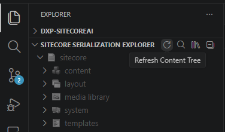

## Features

### 1) Sitecore Serialization Explorer

Adds a custom view in File Explorer: **Sitecore Serialization Explorer**.

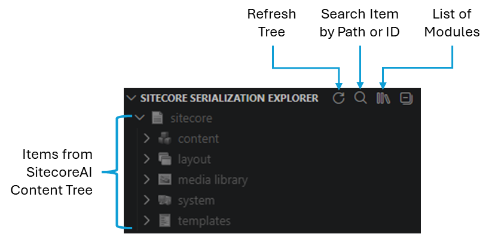

- Items are listed in a content tree in the same way as in Sitecore's Content Editor
- Refresh reloads the tree from scratch
- Items can be quickly searched by **Path** or **ID** - Reveals the item in the tree and opens the Explain Panel for it
- A list of serialization modules is easily available from here

At the bottom of Visual Studio Code there are two aditional filters:

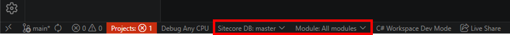

**Database Filtering** - Refreshes tree state for the selected database.

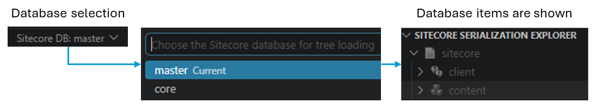

**Module Filtering** - Content is filtered to the selected module scope.

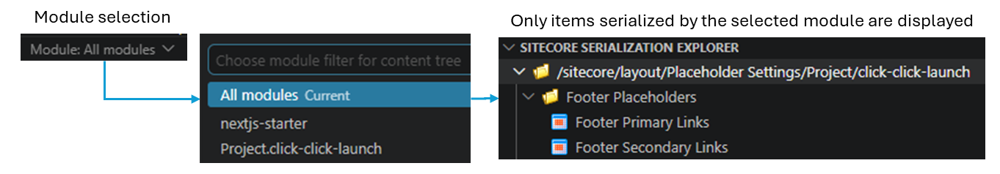

### 2) Explain Panel

Command: **Show Details** (also opens when clicking tree nodes)


For each item, the panel shows:

- Item path.
- Effective serialized/not-serialized status.
- Module match and module description.
  - Click "EDIT" opens the module in Edition Mode
  - Click "VIEW ITEMS" shows a list of items serialized by this module
- Human-readable explain reasons parsed from CLI output.
- YAML physical file (when available).

Actions in the panel:

- Open YAML file.
- Open module JSON file.
- Edit module JSON.
- Jump to include/rule in module JSON.
- Open module items listing.

### 8) Modules Listing Panel

Command: **Show all modules**

- Shows all active modules resolved from `sitecore.json` module globs.
- Displays module namespace, description, references, and resolved JSON path.
- Includes actions to open JSON, edit module, and view module items.

### 9) Module Items Listing Panel

From Explain or Modules panel, **View Items** opens a module items breakdown:

- Groups results by:
  - Master database items
  - Core database items
  - Roles
  - Users
- For each row, shows path/value, status (direct/indirect), include/rule source, and YAML path.
- Supports:
  - Open YAML
  - Copy path/value
  - Copy item ID (when available)

### 10) In-Editor Module JSON Editor

From Explain/Modules panel, **Edit** opens a rich module editor with save support.

Editable areas:

- Module namespace and description
- References
- Includes
- Include rules
- Excluded fields
- Role predicates
- User predicates

Editor capabilities:

- Add/remove includes and rules.
- Add/remove excluded fields, role predicates, user predicates.
- Expand/collapse all includes.
- Drag-and-drop reorder includes.
- Jump navigation to Module / Includes / Excluded Fields / Roles / Users sections.
- Reveal a specific include or rule when opened from Explain actions.

Save behavior:

- Preserves unrelated JSON fields.
- Writes normalized JSON back to the module file.
- Validates required fields before save.

### 11) Context Actions

- **Copy Sitecore Path** from tree item context menu.
- One-click tree refresh.

### 12) Performance Diagnostics (Optional)

When `debug` is enabled (via VS Code setting `sitecoreSerializationViewer.debug` or `DEBUG=true` in `.env.local`):

- Enables performance output channel: **Sitecore Serialization Performance**.
- Logs timing for GraphQL, tree expansion, module item indexing, and reconcile operations.

## Requirements

The extension assumes a Sitecore development workspace with serialization assets.

### Required

- VS Code `^1.110.0`.
- .NET SDK and Sitecore CLI (`dotnet sitecore`).
- A valid Sitecore solution/workspace containing serialization configuration and YAML items.

### Runtime dependencies for full functionality

- **Authoring GraphQL endpoint**: configure via `sitecoreSerializationViewer.authoringGraphqlUrl` (full URL) or `SITECORE_EDGE_HOSTNAME` (hostname). See the [Configuration](#configuration) table.
- **Authentication token** in `.sitecore/user.json` (typically after `dotnet sitecore cloud login`).
  The token is read from `endpoints.<name>.accessToken` where `<name>` defaults to `xmCloud`; override with the `endpoint` setting or `ENDPOINT` env var.
- `dotnet sitecore ser explain` available on PATH for explain/reconciliation features.

### Recommended workspace files

- One or more `sitecore.json` files with `modules` globs.
- Resolved module JSON files (`*.module.json`, `*.json`, etc.) containing `items.includes`.
- Serialized YAML trees under each module root in `items/`.

## Configuration

All options can be set either as a **VS Code setting** (via `settings.json` or the Settings UI) or as a **`.env.local` variable** in the workspace root. VS Code settings take precedence over `.env.local` variables when both are present.

| VS Code Setting | `.env.local` Variable | Default | Description |
|---|---|---|---|
| `sitecoreSerializationViewer.authoringGraphqlUrl` | `SITECORE_EDGE_HOSTNAME` | — | Authoring GraphQL endpoint. The VS Code setting accepts a full URL; the env var accepts a hostname or full URL (the API path is appended automatically). The VS Code setting takes precedence. |
| `sitecoreSerializationViewer.edgeContextId` | `SITECORE_EDGE_CONTEXT_ID` | — | Sitecore Edge context ID sent as the `SC-Edge-Context-Id` request header. |
| `sitecoreSerializationViewer.endpoint` | `ENDPOINT` | `xmCloud` | Endpoint key inside `.sitecore/user.json → endpoints` from which the `accessToken` is read (for example, `dev` if your CLI login stored the token under a `dev` key). |
| `sitecoreSerializationViewer.defaultLanguage` | `LANGUAGE` | `en` | Default Sitecore language for GraphQL requests. |
| `sitecoreSerializationViewer.defaultDatabase` | `DATABASE` | `master` | Default Sitecore database for tree queries. |
| `sitecoreSerializationViewer.debug` | `DEBUG` | `false` | Set to `true` to enable the performance diagnostics output channel: **Sitecore Serialization Performance**. |

## Known Issues

- Multi-root workspaces: current resolution logic uses the first workspace folder for most file and CLI operations.
- If `dotnet sitecore ser explain` is unavailable or slow, some status reconciliation may be delayed or remain unresolved.
- Module discovery depends on `sitecore.json` module globs and modules containing valid `items.includes`; misconfigured modules are skipped.
- GraphQL errors (missing endpoint, invalid token, insufficient permissions, unavailable authoring host) prevent live tree loading.

## Release Notes

Users appreciate release notes as you update your extension.

### 1.0.0

Initial public version of Sitecore Serialization Explorer with:

- Explorer tree integration and serialization status indicators.
- Path/GUID search and reveal.
- Database and module filtering.
- Explain panel with YAML/module navigation.
- Modules listing and module items breakdown.
- In-editor module JSON editing experience.
- Optional performance tracing output.

---

## Following extension guidelines

Ensure that you've read through the extension guidelines and follow the best practices for creating your extension.

- [Extension Guidelines](https://code.visualstudio.com/api/references/extension-guidelines)

## Working with Markdown

You can author this README using Visual Studio Code. Useful editor shortcuts:

- Split the editor (`Ctrl+\` on Windows/Linux, `Cmd+\` on macOS).
- Toggle Markdown preview (`Shift+Ctrl+V` on Windows/Linux, `Shift+Cmd+V` on macOS).
- Press `Ctrl+Space` to open Markdown snippet suggestions.

## For more information

- [Visual Studio Code Markdown Support](https://code.visualstudio.com/docs/languages/markdown)
- [Markdown Syntax Reference](https://www.markdownguide.org/basic-syntax/)

